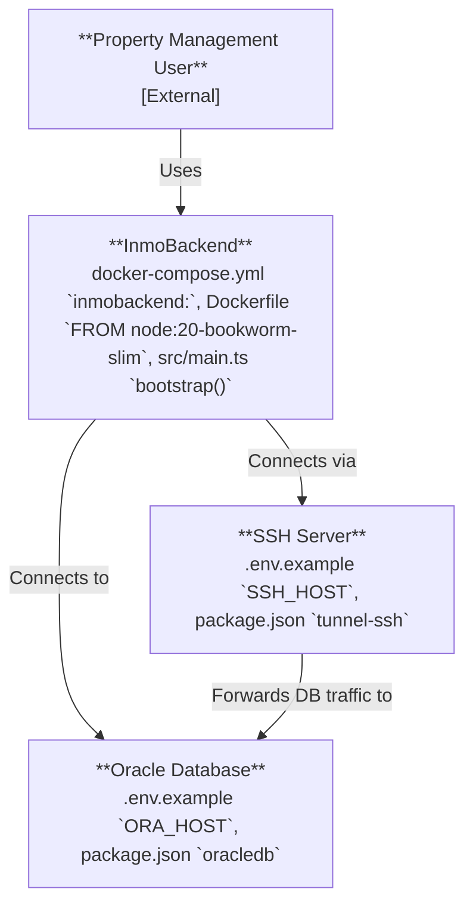

# Unnamed CodeViz Diagram

```mermaid
graph TD

    base.cv::inmobackend["**InmoBackend**<br>docker-compose.yml `inmobackend:`, Dockerfile `FROM node:20-bookworm-slim`, src/main.ts `bootstrap()`"]
    base.cv::oracleDb["**Oracle Database**<br>.env.example `ORA_HOST`, package.json `oracledb`"]
    base.cv::sshServer["**SSH Server**<br>.env.example `SSH_HOST`, package.json `tunnel-ssh`"]
    base.cv::user["**Property Management User**<br>[External]"]
    %% Edges at this level (grouped by source)
    base.cv::user["**Property Management User**<br>[External]"] -->|"Uses"| base.cv::inmobackend["**InmoBackend**<br>docker-compose.yml `inmobackend:`, Dockerfile `FROM node:20-bookworm-slim`, src/main.ts `bootstrap()`"]
    base.cv::inmobackend["**InmoBackend**<br>docker-compose.yml `inmobackend:`, Dockerfile `FROM node:20-bookworm-slim`, src/main.ts `bootstrap()`"] -->|"Connects via"| base.cv::sshServer["**SSH Server**<br>.env.example `SSH_HOST`, package.json `tunnel-ssh`"]
    base.cv::inmobackend["**InmoBackend**<br>docker-compose.yml `inmobackend:`, Dockerfile `FROM node:20-bookworm-slim`, src/main.ts `bootstrap()`"] -->|"Connects to"| base.cv::oracleDb["**Oracle Database**<br>.env.example `ORA_HOST`, package.json `oracledb`"]
    base.cv::sshServer["**SSH Server**<br>.env.example `SSH_HOST`, package.json `tunnel-ssh`"] -->|"Forwards DB traffic to"| base.cv::oracleDb["**Oracle Database**<br>.env.example `ORA_HOST`, package.json `oracledb`"]

```
---
*Generated by [CodeViz.ai](https://codeviz.ai) on 6/4/2026, 16:10:13*
